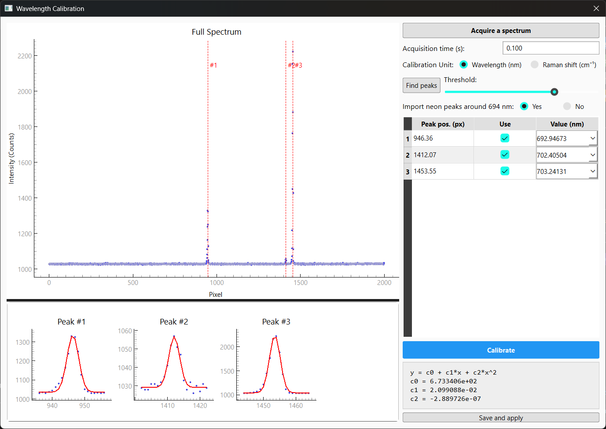

# FluoraPressée: Andor Spectrometer Control & Analysis GUI

Author: Hiroki Kobayashi (Geochemical Research Center, The University of Tokyo). https://orcid.org/0000-0002-3682-7558 E-mail as of 2026: hiroki (at) eqchem.s.u-tokyo.ac.jp

Andor製のカメラ（検出器）および分光器を制御し、スペクトルのリアルタイム取得からバックグラウンド補正、キャリブレーション、ピークフィッティング、そして高圧実験における圧力計算までを一貫して行うためのPythonベースのGUIアプリケーションです。

## Screenshot




## ✨ 主な機能 

* **リアルタイム測定・制御**
  * 1Dスペクトル（Full Range / Custom ROI）および2Dイメージのリアルタイム表示
  * 露光時間、アキュムレーション（積算）回数、検出器冷却温度の制御
  * シングル測定、連続測定、および一定間隔での自動保存（Sequential measurements）
* **分光器制御**
  * 回折格子（Grating）および中心波長の制御
  * 波長（nm）とラマンシフト（cm⁻¹）モードのシームレスな切り替え機能（励起波長設定対応）
* **バックグラウンド補正・キャリブレーション**
  * バックグラウンドスペクトルの取得、保存、リアルタイム差し引き
  * X軸の波長キャリブレーション機能（標準物質のスペクトルのピークをGaussianでフィットし、ピーク位置を決定する→文献値を用いて、ピクセルと波長ないしRaman shiftの関係を２次式でフィット）
* **リアルタイム・ピークフィッティング**
  * Gauss, Lorentz, Pseudo Voigt 関数の単一ピーク・ダブルピークフィッティング
  * フィッティング範囲の自動・手動設定
* **圧力計算機能 (高圧実験向け)**
  * 蛍光シフトによる圧力計算
    * Ruby（圧力シフト：Shen+ 2020, Mao+ 1986, Piermarini+ 1975. 温度補正：Ragan+ 1992）
    * Sm<sup>2+</sup>:SrB<sub>4</sub>O<sub>7</sub>（圧力シフト：Datchi+ 1997. 温度シフト：Datchi: 1997）

## 🛠 必須環境 (Requirements)

* **OS**: Windows 10 / 11 (Andor SDKの動作環境に依存します)
* **Python**: Python 3.8 以上
* **Hardware**:
  * Andor製 カメラ（検出器）
  * Andor製 分光器
* **Drivers/SDK**:
  * Andor SDK (ドライバパッケージがPCにインストールされている必要があります)

### 依存Pythonパッケージ
* PyQt6
* pyqtgraph
* numpy
* scipy

## 📥 インストール方法 (Installation)

1. コマンドプロンプトまたはPowerShellを開きます。
2. 必要なPythonパッケージをインストールします。

    pip install PyQt6 pyqtgraph numpy scipy

3. Andor SDKが正しくインストールされていることを確認します。
4. このプロジェクトのディレクトリに移動し、スクリプトを実行します。

## 🚀 使い方 (Usage)

### 起動方法
以下のコマンドでアプリケーションを起動します。

    python ui.py

※ ハードウェアを接続せずにUIのテストだけを行いたい場合は、デバッグモードで起動できます。

    python ui.py --debug

### 基本的な測定フロー
1. **冷却の開始**:
   右側パネル「Measurement」内の「Cooler target temp」を設定し、カメラの冷却が安定するのを待ちます。
2. **分光器の設定**:
   「Spectrometer Configurations」セクションで、使用する回折格子と中心波長（またはラマンシフト）を入力し、**「Apply」** をクリックして分光器を動かします。
3. **バックグラウンドの取得 (任意)**:
   シャッターを閉じた状態で「Background」セクションの **「Acquire and save background」** をクリックし、バックグラウンドデータを取得・保存します。
4. **測定の実行**:
   * **Take single spectrum**: 設定された露光時間と積算回数で1回だけ測定を行います。
   * **Commence Measurement**: 連続的にスペクトルを取得し、画面にリアルタイム表示します。停止するには「Terminate Measurement」を押します。
5. **データの保存**:
   * 現在表示されているスペクトルを保存するには **「Save data」** をクリックします。
   * 自動的に連続保存したい場合は、**「▶ Sequential measurements」** を開き、ディレクトリと保存間隔（Skip frames）、最大保存枚数を設定して **「Start Sequential」** をクリックします。

### フィッティングと圧力計算
* 「Fitting Configurations」を **ON** にすると、表示されているスペクトルに対してリアルタイムでフィッティングが行われます。
* ダブルピークでフィッティングが成功している場合、「Pressure Calculation」セクションを **ON** にすることで、ルビーのR1ピークから圧力を自動計算して表示させることができます。

## 📁 保存されるファイル

### データファイル

#### Background を差し引かない場合

```
# Date: 2026-04-15 20:22:03
# Grating: 1200 grooves/mm
# Spectrometer Mode: Wavelength
# Center Wavelength: 694.0 nm
# Acquisition Time: 0.1 s
# Accumulations: 1
# Wavelength_or_Pixel,Intensity
673.63,1122
673.65,1130
673.671,1126
673.691,1126
673.712,1125
673.732,1132
673.753,1128
...
```

#### Background を差し引く場合
```
# Date: 2026-04-15 21:05:42
# Grating: 1200 grooves/mm
# Spectrometer Mode: Wavelength
# Center Wavelength: 694.0 nm
# Acquisition Time: 2.0 s
# Accumulations: 1
# Wavelength_or_Pixel,Intensity_Subtracted,Intensity_Raw,Background
673.341,2,1031,1029
673.362,3,1035,1032
673.383,3,1031,1028
673.404,-7,1029,1036
673.425,-1,1032,1033
673.446,5,1036,1031
673.467,0,1030,1030
673.488,-2,1032,1034
673.508,1,1031,1030
673.529,-3,1029,1032
...
```

### Background file
```json
{
    "detector_settings": {
        "mode": "1D Spectrum (Custom ROI)",
        "roi_start": 100,
        "roi_end": 140
    },
    "acquisition_time": "1.00",
    "signal": [
        1085,
        1089,
        1088,
        1090, ...
    ]
}
```

### Configuration file
```json
{
    "timestamp": "2026-04-15 21:01:52",
    "spectrometer_settings": {
        "grating_grooves_per_mm": "1200",
        "center_value": 694.0,
        "unit": "Wavelength"
    },
    "detector_settings": {
        "mode": "1D Spectrum (Custom ROI)",
        "roi_start": 113,
        "roi_end": 125
    },
    "calibration_coefficients": {
        "c0": 673.3405851432854,
        "c1": 0.020990883361968825,
        "c2": -2.889725985123467e-07
    }
}
```


## 📁 ファイル構成

* ui.py: メインのGUIアプリケーションスクリプト。
* camera.py: Andorカメラを制御し、データや温度を取得するスレッドクラス。
* spectrometer.py: Andor分光器の回折格子や波長を制御するモジュール。
* analysis.py: スペクトルデータのピークフィッティング処理を行います。
* calibration_ui.py: ピクセルから波長へのキャリブレーションを行うためのUI。
* pressureCalc.py: ルビー蛍光から圧力を算出するモジュール。
* spectrometerConfig.json: 回折格子の設定等を保存する設定ファイル（初回起動時に生成）。

#### spectrometerConfig.json 

ほぼ変えることがないと思われるため、UIから変更する仕様にはなっていない。必要があれば手動で変更する。

```json
{
    "dll_path": "C:\\Program Files\\Andor SDK\\Shamrock64\\ShamrockCIF.dll",
    "grating": [
        {
            "index": 1,
            "grooves": 2400,
            "defaultROI": {"from": 80, "to": 100}
        },
        {
            "index": 2,
            "grooves": 1800,
            "defaultROI": {"from": 115, "to": 130}
        },
        {
            "index": 3,
            "grooves": 1200,
            "defaultROI": {"from": 113, "to": 125}
        }
    ],
    "flip_x": true
}
```

## 謝辞
このプログラムは私が作成したものですが、機能やデザインに関する多くのアイデアは、私がStefan Klotz氏との共同研究のためにフランス・パリ・ソルボンヌ大学-CNRS UMR 7590 IMPMCに滞在した際によく使用していた、[Rubycond](https://github.com/CelluleProjet/Rubycond)プログラムから着想されたものです。Rubycondの開発者であるYiuri Garino (yiuri.garino (at) cnrs.fr)氏に感謝申し上げます。またこのプログラムは東京大学大学院理学系研究科附属地殻科学実験施設 鍵裕之
教授・小松一生准教授の研究室で開発されました。最後に、開発に際してGeminiに多くの有用な助けを借りたことを申し添えます。

<!-- ## 使用した圧力スケールに関する参考文献

*  -->